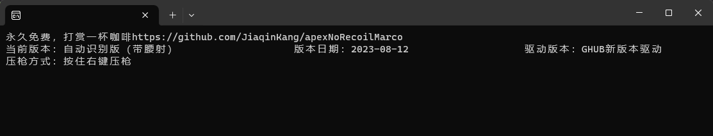

# U HUB -- 通用外设 Lua 运行时 An Universal Lua Runtime for Peripherals

开发是为了教育目的，不对本项目造成的任何损失负责。
The purpose of this project is for educational purposes. This project is not responsible for any loss caused by this software.

## 介绍 Introduction

受到罗技 GHub 的启发，本项目实现了一个适用于所有品牌鼠标的 Lua 运行时，能够兼容不依赖于 M/G 键的罗技宏 Lua 脚本。本项目基于 LuaJIT 开发，支持 Windows 平台。  
Inspired by Logitech GHub, this project implements a Lua runtime for all brands of mice, which is compatible with Logitech macro Lua scripts that do not depend on M/G keys. This project is developed based on LuaJIT and supports the Windows platform.

> 图片中的宏来自 [apexNoRecoilMarco](https://github.com/JiaqinKang/apexNoRecoilMarco) 项目。  
> The macro in the picture comes from the [apexNoRecoilMarco](https://github.com/JiaqinKang/apexNoRecoilMarco) project.

## 使用方法 Usage

1. 下载本项目的 Release 版本，解压到任意目录。 Download the release version of this project and unzip it to any directory.
2. 将 `jit/script.lua` 替换为你的 Lua 脚本。 Replace `jit/script.lua` with your Lua script.
3. 以管理员权限运行 `UHUB.exe`。 Run `UHUB.exe` as an administrator.

## 功能 Features

本项目的 Lua 支持基于 [G-series Lua API V8.45](https://douile.com/logitech-toggle-keys/APIDocs.pdf) 开发。 The Lua support of this project is based on [G-series Lua API V8.45](https://douile.com/logitech-toggle-keys/APIDocs.pdf).

由于与厂商相关，以下函数部分支持 Below function(s) are partially supported:

> - OnEvent(event, arg, family)
> - [x] PROFILE_ACTIVATED/PROFILE_DEACTIVATED
> - [x] MOUSE_BUTTON_PRESSED/MOUSE_BUTTON_RELEASED
> - [ ] G_PRESSED/G_RELEASED
> - [ ] M_PRESSED/M_RELEASED

由于与厂商相关，以下函数不支持 The following function(s) are not supported:

> - GetMKeyState()  
> - SetMKeyState()  
> - SetMouseDPITable()  
> - SetMouseDPITableIndex()  
> - OutputLCDMessage()  
> - ClearLCD()  
> - SetBacklightColor()  
> - PlayMacro()  
> - AbortMacro()  
> - SetSteeringWheelProperty()  
> - (G13) SetMouseSpeed()  
> - (G13) GetMouseSpeed()  
> - (G13) IncrementMouseSpeed()  
> - (G13) DecrementMouseSpeed()  

### 如果有所帮助，希望能给我一颗星星 If it helps, I hope you can give me a star
### 欢迎提交 PR 完善本项目 Welcome to submit PR to improve this project

